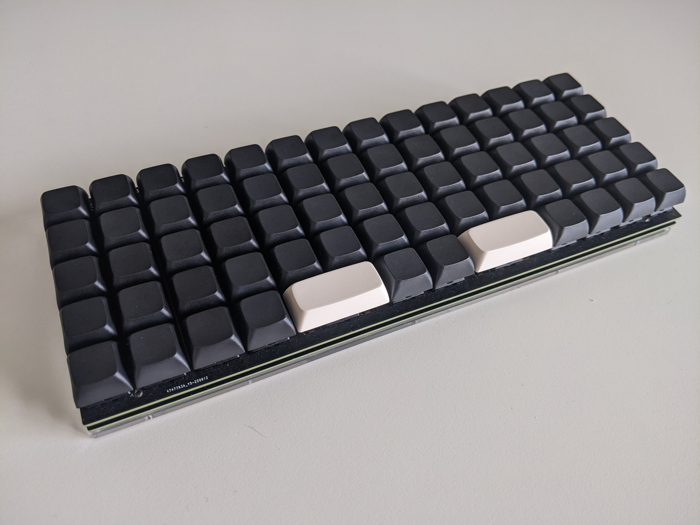
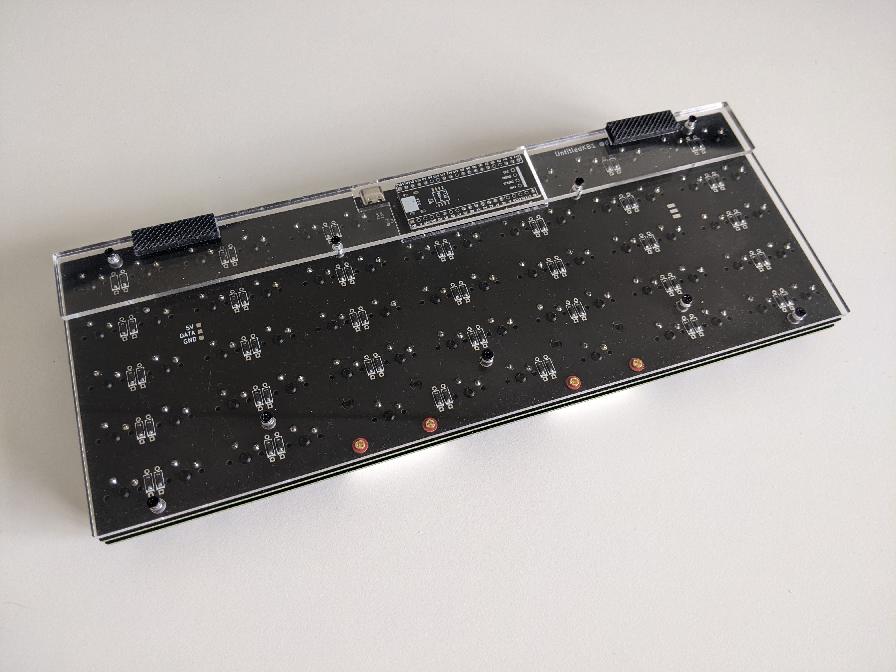

 # UntitledKb1

 A 5x14 ortholinear board with an STM32 Blackpill. USB port is removed and rotated to face the back, which avoids any issues with trying to fit a usb cable sideways. This board  needs a decent amount of SMD soldering experience for the diodes and USB-C port resistors. 
 
 BOM
 - STM32 Blackpill or similar footprint
 - 1x PCB and FR4 plate
 - 1 Acrylic base cut
 - 2x 5.1k resistors 0402 (can take from stm32 blackpill)
 - 1x 0ohm resistor (optional, just solder copper wire over the pads)
 - 70 Diodes (depends on key count)
 - 70 MX Switches
 - 7mm spacers + some more spacers for the 2nd acrylic panel
 - m2x8 or m2x10 screws x4 (top plate)
 - m2x5 to m2x8 screws x5 (bottom part of plate)
 - Rubber feet (optional)
 - Stabilizers (optional)

 
 
